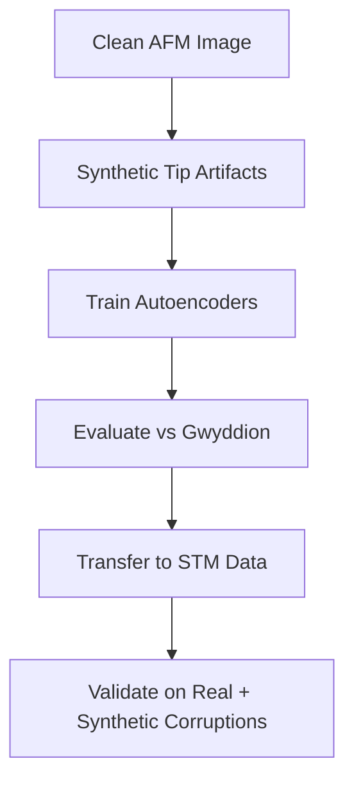

# 2024 Worldwide Microscopy Hackathon
# Mitigating Tip-Induced Artifacts in AFM Images Using Autoencoder-Based Solutions

Group Members: Srikar Rairao (University of Tennessee Knoxville, team lead), Nikola Kolev (University College London), Tommaso Rodani (AREA Science Park), Sergey Ilyev (Moscow Institute of Physics and Technology), Viktoriia Liu, Mikhail Petrov (Tufts University)

> **Goal:** Restore AFM images corrupted by **tip-induced artifacts** using deep learning autoencoders to improve nanoscale imaging accuracy.
>
> **Scientific Context:** AFM and STM produce high-resolution nanoscale images, but **blunt or asymmetric tips** introduce severe distortions.  Traditional methods like Gwyddion are limited in **accuracy**, **speed**, and **automation**. 
> Our project demonstrates a deep-learning-based correction pipeline using **autoencoders** trained on **synthetically corrupted images** to recover the underlying structure, paving the way for generalizable image restoration across microscopy modalities.

---

## Project Workflow Outline



---

## 1 Plan → Execution

| Stage | Artefact | Key Choices & Rationale |
|----------------------------------|------------------------------------------------|-----------------------------------------------------------|
| **Problem Framing** | Hackathon whiteboard → tip artifact mitigation | Needed to improve AFM image quality by modeling tip distortions |
| **Data Preparation** | `notebooks/AFM_Tip_Artifact_Reconstruction.ipynb` | Used Gaussian convolutions on a single AFM image to simulate tip defects |
| **Model 1** | ~70 epochs, no skip connections | Learned residuals between clean and corrupted images; MAE + SSIM loss |
| **Model 2** | 33k param AE, 1000 epochs | Compact model trained on 1200 STM images; overfit-resistant |
| **Model 3** | Deep AE with skip connections | 6.7M params; used MAE + SSIM + Gradient loss to reduce blur in edges |
| **Baselines** | Gwyddion | Compared Gwyddion’s tip estimation and reconstruction with ML results |
| **Evaluation** | `results/` | PSNR, VIF, SSIM scores analyzed; Model 3 achieved SSIM ≈ 0.95 |
| **Transfer Validation** | `notebooks/STM_Transfer_Validation.ipynb` | Applied AFM-trained model to STM images to test generalizability |

---

## 2 Outcomes

| Model | PSNR | VIF | SSIM |
|----------------|--------|--------|---------|
| Corrupted Input | ~17–25 | ~0.07 | — |
| Gwyddion | ~22 | ~0.06 | — |
| **Model 1** | ~15 | 0.10 | — |
| **Model 3** | — | — | **0.9534** |

- Model 3 shows **high perceptual quality** with edge awareness.
- Promising **cross-modality transfer** to STM, though further tuning required.

---

## 3 Decisions & Trade‑offs

* **Why autoencoders over classical tools?**
  - Autoencoders generalize better and require no manual tuning once trained.
  - Unlike Gwyddion, they reconstruct **nonlinear deformations** and fine details.

* **Why generate synthetic data?**
  - Ground truth for tip artifacts is unavailable.
  - Synthetic Gaussian corruption gives full control over severity and randomness.

* **Why SSIM + Gradient loss?**
  - Improves structural similarity (SSIM) and **restores edges**, preventing blur.

* **Why test on STM?**
  - AFM and STM share similar imaging artifacts—testing on STM helps evaluate **model robustness** and cross-technique usability.

---

## 4 Research Fit

* Can be integrated into **real-time microscope feedback loops**.
* Applicable to **blunt tip correction**, and expandable to **double-tip** or **unknown PSF estimation**.
* Open to adaptation across **AFM, STM, and SEM** use cases in materials science and nanotech research.

---

## 5 Limitations & Next Steps

| Area | Notes |
|----------------|---------------------------------------------------------------|
| **Dataset** | Based on one clean image → synthetically corrupted AFM dataset |
| **Generalization** | Real STM results were preliminary — needs broader training |
| **Architecture** | Model 3 needs more epochs and regularization for cleaner recon |
| **Real-time use** | Not yet integrated with active scanning workflows or microscope APIs |

---

## 6 Quick‑start

```bash
git clone https://github.com/YOUR_USERNAME/afm-tip-artifact-autoencoder.git
cd afm-tip-artifact-autoencoder
pip install -r requirements.txt

# Run Jupyter notebook for model 3 (best model)
jupyter notebook notebooks/AFM_Tip_Artifact_Reconstruction.ipynb

# Published Paper on all Projects in this Hackathon including this one
https://arxiv.org/abs/2506.08423
```

---

## 7 Repo Map

```
.
├── models/                  # Trained model weights
├── notebooks/              # Core notebooks for training + evaluation
│   ├── AFM_Tip_Artifact_Reconstruction.ipynb
│   └── STM_Transfer_Validation.ipynb
├── data/                   # Clean and synthetic corrupted images
├── results/                # Evaluation metrics and sample outputs
├── requirements.txt
└── README.md               # This file
```

---

## 8 Future Work

- Expand training to **multi-image AFM/STM datasets**
- Use **unsupervised disentanglement** for tip geometry estimation
- Build **real-time plugin** for open-source AFM software (e.g., PyCroscopy)
- Investigate **transformer-based denoising** for edge preservation
- Build localized tip artifact reconstruction algo for **MIC Hackathon 2025**

---

## 9 Contact

**Srikar Rairao**  
📧 `rairao.srikar@gmail.com`  
🔗 [GitHub](https://github.com/sharkz0912) • [LinkedIn](https://linkedin.com/in/srikar-rairao)

---
**Note**: Developed at the MIC-Hackathon 2024. Thanks to the organizers, mentors, and collaborators for datasets, discussions, and Gwyddion benchmarks.
